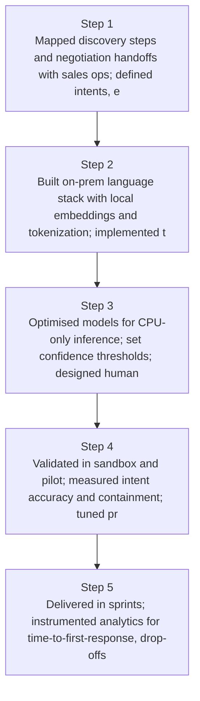
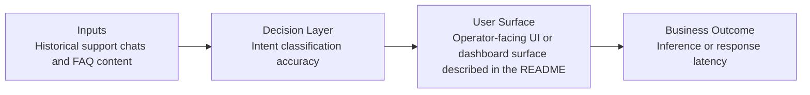
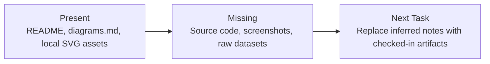

# LLM Sales Assistant Diagrams

Generated on 2026-04-26T04:29:37Z from README narrative plus project blueprint requirements.

## Conversation flow diagram

## Intent classification accuracy

## Evidence Gap Map

